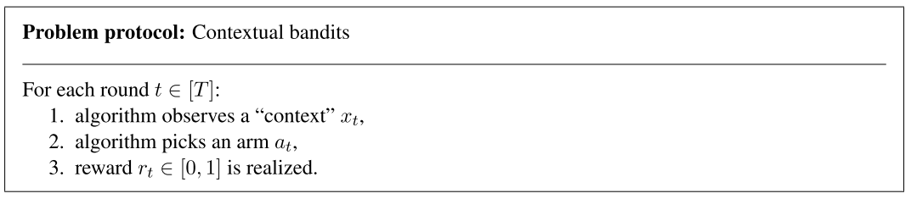
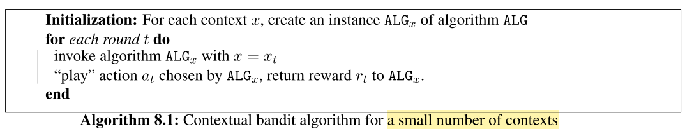
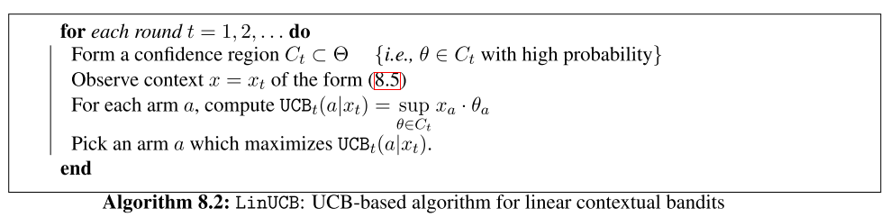
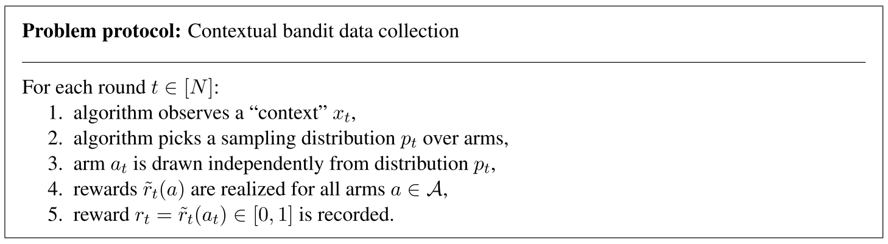
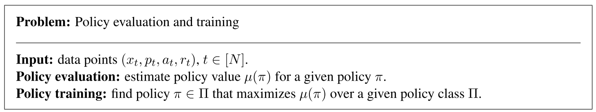

# Contextual Bandits

## 基本介绍

`Contextual Bandits`可以理解为MAB的一种扩展：对于普通MAB，算法对每个arm的选择仅仅依赖于reward；而对于contextual bandits，算法对arm的选择除了reward外，还依赖于context。

具体举例来说，假设有一个推荐系统，会给用户推荐图片。如果是**普通的MAB**，他的推荐算法可能是：给每个用户同时推荐（选择arm）狗和猫的图片（explore），并记录用户的点击（reward），根据用户以往的点击来改善推荐的内容（exploit）。如果是**Contextual bandit**，他的推荐算法则是：首先给每个用户建立profile，了解他们的个人喜好，比如某个用户喜欢狗，那么这个“喜欢狗”则作为该用户的context，算法依此会多给用户推荐狗的图片，再根据用户的点击不断调整（reward）。

当然`context`远不止这么简单，除了用于描述用户的profile外，还可以用于描述**环境特征**：比如当前时间是白天还是晚上；用于归纳**可以给用户提供的arm（action）**：比如网站分级，对于少儿不宜的内容不能展示给青少年用户，这个可以展示的arm集合则是青少年用户的context；用于描述**arm本身的固有特征**，尤其当这个特则可以随时间变化时：比如动物图片和人物图片，这两者在推荐的时候不能一概而论。

> [参考博客](https://towardsdatascience.com/contextual-bandits-and-reinforcement-learning-6bdfeaece72a)

## 问题预设

其中reward $r_t$不仅依赖于action $a_t$，也依赖于context $x_t$。因此，我们用$\mu(a|x)$表示给定context $x$下选择arm的平均reward。此时`Regret`定义如下：

$$
算法获得的rewards：REW(ALG) = \sum^T_{t=1}r_t\\
最优rewards的策略: \pi^*(x) = max_{a\in \mathcal{A}}\mu(a|x)\\
Regret：R(T) = REW(\pi^*)-REW(ALG)
$$

## 基本算法

### 少量contexts

当contexts的数量不多，我们可以将**每个context**下的arm选择问题看作是一个MAB问题，对其应用MAB算法。

其中$ALG_x$是算法$ALG$的复制。

MAB算法的普遍Regret:$E[R_{ALG}(T)] = O(\sqrt{KTlogT}).$

那么，上述算法的`Regret`：

假设$n_x$是context $x$下的摇臂轮次，那么对于这个特定的context，$n_x$轮的Regret是$O(\sqrt{Kn_xlnT})$. 所有contexts的总regret：
$$
E[R(T)] = \sum_{x\in \mathcal{X}} E[R_x(T)] = \sum_{x\in \mathcal{X}} O(\sqrt{Kn_xlnT}) \le O(\sqrt{KT|\mathcal{X}|lnT}).
$$
其中$\mathcal{X}$是所有contexts的集合。

当$|\mathcal{X}|$的值很大，Regret就会变得很大，因此这个算法并不能应用于大量contexts的场景下。

### Lipshitz contextual bandits

当想要处理很多contexts，我们可以考虑`Lipschitz Bandits`的处理方法：将contexts映射到$[0,1]$区间，让expected rewared对contexts是Lipshitz连续的，即对任意$x$和$x'$，i、以及任意arm $a$，存在Lipshitz常数$L$满足下式：
$$
|\mu(a|x)-\mu(a|x')| \le L\cdot |x-x'|.
$$
其中L对bandit算法已知。

解决这个问题的一个方法是将context空间离散化，定义$S$是$[0,1]$上的$\epsilon-uniform\ mesh$，即$S$是$[0,1]$上所有值为$\epsilon$倍数的点组成的点集。我们可以取$\epsilon = 1/(d-1)$,其中$d$是$S$中点的个数。

我们将前面少量contexts中的算法应用到context空间$S$中，称之为$ALG_s$。定义$f_S(x)$为从context x到$S$中最近的点的映射：
$$
f_S(x) = min(argmin_{x'\in S} |x-x'|).
$$
那么整个`算法描述`如下：在每一轮$t$，将该轮的每个context $x_t$用$f_S$映射到S中，接着执行算法$ALG_S$.

对于这个算法，`Regret`有两项：$ALG_S$的Regret和离散化误差。

我们定义整个算法的最优reward策略$\pi_S^*: \mathcal{X} \to \mathcal{A}$:
$$
\pi_S^*(x) = \pi^*(f_S(x))\ \ \ for\ each\ context\ x\in \mathcal{X}.
$$
$ALG_S$的regret和离散化误差定义如下：
$$
R_S(T)= REW(\pi^*_S)-REW(ALG_S)\\
DE(S) = REW(\pi^*) - REW(\pi^*_S).
$$
那么总的Regret则是：$R(T) = R_S(T) + DE(S).$ 其中根据前面一项的Regret是$O(\sqrt{KT|S|lnT})$,我们也可以得到后一项的Regret：$E[DE(S)]\le \epsilon LT.$ 因此得到`总Regret上界`：
$$
E[R(T)] \le \epsilon LT + O(\sqrt{\frac{1}{\epsilon}}KTlnT) = O(T^{2/3}(LKlnT)^{1/3}).
$$

这个算法将Lipshitz结构应用于bandit之中，通过将大量context映射到区间的方式，让bandit可以活用Lipshitz的性质从而求得Regret上界。

> ==Lipschitz Bandits参考文献==：Magureanu, S., Combes, R., & Proutiere, A. (2014). Lipschitz Bandits: Regret Lower Bounds and Optimal Algorithms. Journal of Machine Learning Research, 35(2013), 975–999. http://arxiv.org/abs/1405.4758

### Linear contextual bandits

我们也可以参考`Linear bandits`的做法：假设每个arm $a$都有自己的特征向量$x_a \in [0,1]^d$，并且expected reward和这个向量呈线性关系:$\mu(a) = x_a \cdot \theta$，其中$\theta$未知并且固定$\theta \in [0,1]^d$。那么下面的元组就可以表示一种固定的context，它指代arm $a$的固有特征，并不随轮次$t$变化：
$$
x = (x_a \in \{0,1\}^d : a \in \mathcal{A})
$$
应用到Linear contextual bandits的话，上面的二元组就是context的表现形式，`expected reward`则是：
$$
\mu(a|x) = x_a \cdot \theta_a
$$
令$\Theta$表示所有可能的$\theta$向量的集合，$\Theta$对bandit算法已知。这个问题可以用UCB的方法解决，我们用$\theta$的“置信区域”来取代UCB中arm $a$的置信区间。我们将这个算法命名为`LinUCB`：选择一个$C_t \in \Theta$作为置信区域，那么对于此arm，$\theta$坐落在置信区域的概率是很高的；我们可以根据$C_t$来得到一个UCB，并据此选择UCB最大的arm。

### Contextual bandits with a policy class

那么如果不想要对rewards进行限制，如何对更普遍的contextual bandits进行研究呢？我们可以对context和action进行映射，每种映射作为一个`policy`，每个policy来源于已知的policy类$\Pi$. 那么bandit算法需要做的就是找出最好的policy。

我们定义基于policy $\pi$和context $x$的action选择所得到的reward，称之为policy value:
$$
\mu(\pi) = E_{x\in D}[\mu(\pi(x))|x].
$$
基于此我们可以计算Regret：
$$
R_{\Pi}(T) = Tmax_{\pi \in \Pi} \mu(\pi) - REW(ALG).
$$

policy可以基于`score predictor`：对于任意context $x$，算法对每个arm $a$的选择都会进行打分，并选择分数最高的arm。这个分数可以依据rewards来制定，也可以依据别的。

policy也可以基于`decision tree`：用**内部节点**表示对context某些性质的测试；**边**表示测试的可能结果；**终端节点**则对应特定的action。当这种policy执行的时候，从根节点开始遍历所有的边直到遇到终端节点。

这个问题可以用`Exp4`的思路，将policies当作experts来执行，此时Regret为:
$$
E[R_{\Pi}(T)] = O(\sqrt{KTlog|\Pi|})
$$
但每轮的执行时间是关于$|\Pi|$线性的。

也可以将他和传统的`分类问题`相关联，首先考虑full-feedback类型的contextual bandits，即bandit算法可以知道每轮其他arm的结果，那么算法可以将context当作样本，arms当作label，对每个样本都有一个正确的label其reward是1，其他的是0. 这样就把contextual bandit问题转化成了传统的分类问题。

### Learning from contextual bandit data

contextual bandit算法收集到的数据也可以`线下分析`，分析之后再做出摇臂的决定。我们将数据收集的过程用如下问题模型表述：

数据评估和训练描述如下：

我们用如下公式来评判各个policy的好坏：
$$
IPS(\pi) = \sum_{t \in [N]:\pi(x_t)=a_t} \frac{r_t}{p_t(a_t)}.
$$

> 具体说明略，详见[Introduction to MABs](http://arxiv.org/abs/1904.07272) P98

我们可以用exploration轮收集到的数据训练policy，并用IPS指标评判各个policy好坏，就和传统的分类问题一样。